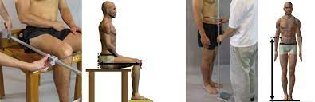
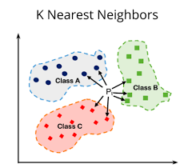
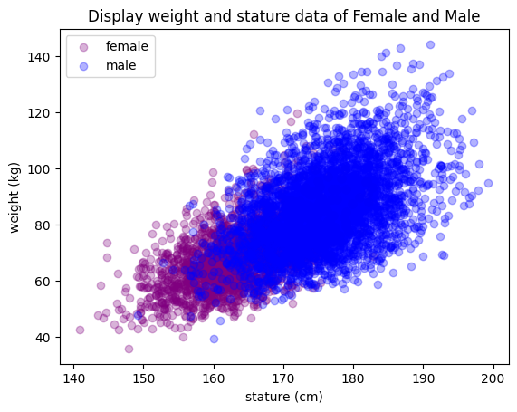
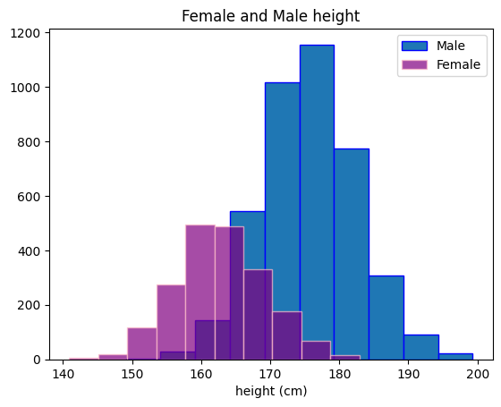
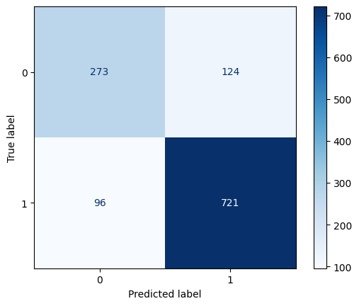
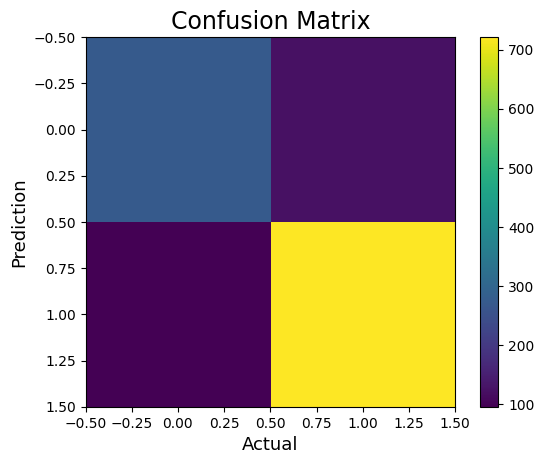
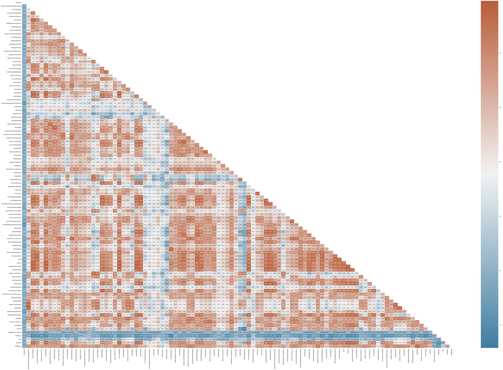
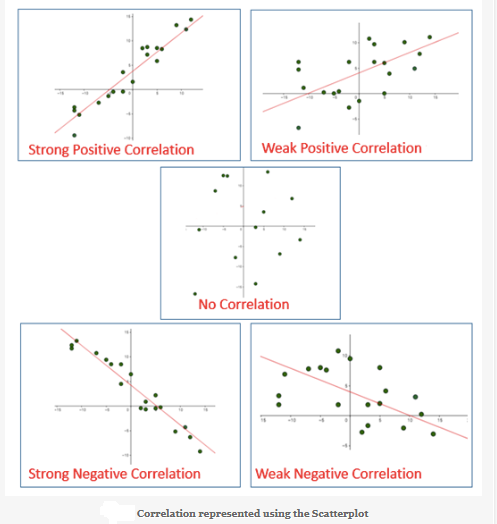

# ANSUR_||

Using dataset [ANSUR_||](https://www.kaggle.com/datasets/seshadrikolluri/ansur-ii), which is available on the site, we want to predict whether the new person is a man or a woman, and we do this by using the k-Nearest Neighbors Algorithm.
**(KNN)**

---
## python

The python version of this program uses the [Numpy](https://numpy.org/doc/stable/user/absolute_beginners.html) library to design the K Nearest Neghbors Classification class(knn).

### Usage 
First install requirments packages:
~~~
pip install numpy
~~~

Then you can run the progrram:
~~~
python knn.py
~~~

## Jupyter Notebook

### Usage 
First install requirments packages:

[Jupyter Notebook](https://www.geeksforgeeks.org/install-python-package-using-jupyter-notebook/)

[matplotlib](https://matplotlib.org/stable/users/installing/index.html)

[pandas](https://pandas.pydata.org/docs/getting_started/install.html)

---

## Description

- ANSUR :

Gender prediction using features :

weight(kg)

stature(cm)

Calculate the accuracy of the algorithm

- ANSUR2 :

correlation heatmap python

~~~
pip install seaborn
~~~

- ANSUR3

Add other features to increase the accuracy of the algorithm compared to ANSUR

## plot

✨Standard deviation is a number that describes how spread out the values are.

A low standard deviation means that most of the numbers are close to the mean (average) value.
A high standard deviation means that the values are spread out over a wider range.

standard deviation_Male > standard deviation_Female
count of Male > count of Female

So, it can be said that according to the standard deviation, men's height is more than women's, and according to the average value, men's height is 175 cm more than women's height is 162 cm, and the number of men is more than women, and it seems that all These were effective

- Algorithm accuracy

| k      | 3      | 
| :---   | :----  |
|knn Score | 82.1%  |
|KNN Score | 81.1%  |

- Display the confusion matrix diagram with sklearn

- Display the confusion matrix diagram with matplotlib

| k       | 3       | 5       | 7       | 10       | 15       |
| :---    | :----   | :----   | :----   |  :----   | :----    |
|knn Score| 89.5%   | 87.6%   | 87.2%   | 86.8%    | 86.4%    |
|KNN Score| 89.5%   | 87.6%   | 87.2%   | 86.8%    | 86.4%    |

---

What is the effect of K on bias and variance in KNN?
            
        Let's observe its effect. If we consider different values of k, we can observe the trade-off between bias and variance. As k increases, we have a more 
        stable model, i.e., smaller variance, however, the bias is also increased. As k decreases, the bias also decreases, but the model is less stable.

Why Does Increasing k Decrease Variance in kNN?
scores obtained on the different folds?
       
        The lower the value, the higher the bias in the error estimates and the less variance. Conversely, when k is set equal to the number of instances, the error 
        
        estimate is then very low in bias but has the possibility of high variance.

What does a larger value of k in the k fold cross validation imply bias and variance?
Does larger K value implies less variance for K cross-validation?
Why does increasing K decrease variance in KNN?

        When we increase K, the training error will increase (increase bias), but the test error may decrease at the same time (decrease variance). We can think that when K becomes larger, since it has to consider more neighbors, its model is more complex.

What is Correlation Heatmap?

    Correlation heatmaps are a type of plot that visualize the strength of relationships between numerical variables. Correlation plots are used to understand which variables are related to each other and the strength of this relationship. A correlation plot typically contains a number of numerical variables, with each variable represented by a column. The rows represent the relationship between each pair of variables. The values in the cells indicate the strength of the relationship, with positive values indicating a positive relationship and negative values indicating a negative relationship. Correlation heatmaps can be used to find potential relationships between variables and to understand the strength of these relationships. In addition, correlation plots can be used to identify outliers and to detect linear and nonlinear relationships. The color-coding of the cells makes it easy to identify relationships between variables at a glance. Correlation heatmaps can be used to find both linear and nonlinear relationships between variables.

### Correlation heatmap

How to drop out highly correlated features in Python?

have a huge data set and prior to machine learning modeling it is always suggested that first you should remove highly correlated descriptors(columns) how can i calculate the column wice correlation and remove the column with a threshold value say remove all the columns or descriptors having >0.8 correlation. also it should retained the headers in reduce data..
The value of the correlation coefficient can take any values from -1 to 1.
If the value is 1, it is said to be a positive correlation between two variables. This means that when one variable increases, the other variable also increases.
If the value is -1, it is said to be a negative correlation between the two variables. This means that when one variable increases, the other variable decreases.
If the value is 0, there is no correlation between the two variables. This means that the variables changes in a random manner with respect to each other.

more information :

~~~
Notebook 127 - How to drop out highly correlated features in Python.ipynb
~~~
----

---

### Evaluate the scikit-learn KNN algorithm on the test dataset. Make sure your accuracy is equal to scikit-learn's accuracy.

| k                                                                      | 3      | 5      | 7      | 9     | 15      |
| :---                                                                   | :----  | :----  | :----  | :----   | :----   |
| Scores obtained by weight and stature features                         | 83.3%  | 84.5%  | 84.8%  | 85.2%   | 85.1%   |
| Scores obtained by weight and Buttock Circumference features           | 97.86% | 97.94% | 98.11% | 98.02% | 97.86%  |
| Scores obtained by weight, stature and   thighcircumference features  | 82.04% |  83.20% | 83.94% | 84.51%  |  84.51%  |
| Scores obtained by weight, stature and   thighcircumference features  | 92.50% |  93.49% | 93.90% | 93.90%  |  94.07%  |

